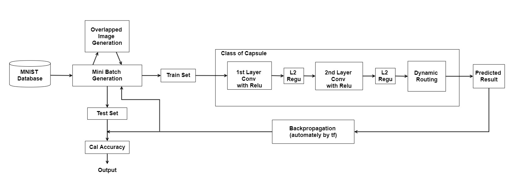
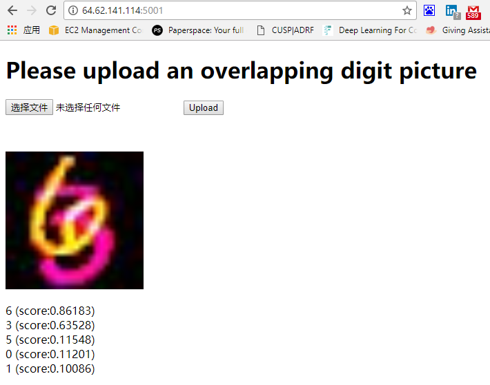

# Overlapping object segmentation using CapsNet
| Member | Email | Github |
| :--: | :--: | :--: |
| Zhiao Zhou | <zz1749@nyu.edu> | <https://github.com/zhiaozhou> |
| Jianghao Zhu | <jz2575@nyu.edu> | <https://github.com/jz2575> |
| Chenyu Xu | <cx463@nyu.edu> | <https://github.com/cx463> |

# CapsNet/Capsule
Please refer to Geoffrey E Hinton's original paper [Dynamic Routing Between Capsules](https://arxiv.org/abs/1710.09829)

# Architecture

# Demo
This project also contains a demo website that classifies any overlapping digit image you upload

# Reference
[1] M. Abadi, A. Agarwal, and et al. Tensorflow: Large-scale machine learning on heterogeneous distributed systems. 2016.
[2] J. Ba, V. Mnih, and K. Kavukcuoglu. Multiple object recognition with visual attention. 2014.
[3] J. Chang and Y. Chen. Batch-normalized maxout network in
network. arXiv, 2015.
[4] J. Goodfellow, Y. Bulatov, and et al. Multi-digit number recognition from street view imagery using deep convolutional neural networks. 2013.
[5] laodar. a tensorflow implementation for capsnet.
[6] A. Prochazka and M. Yadollahi. Image segmentation for object detection. 2011.
[7] S. Sabour, N. Frosst, and G. Hinton. Dynamic routing between capsules. 2017.
[8] L. N. Smith. Cyclical learning rates for training neural networks. 2017.
